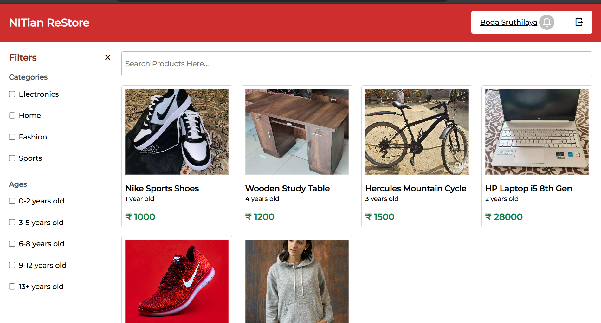
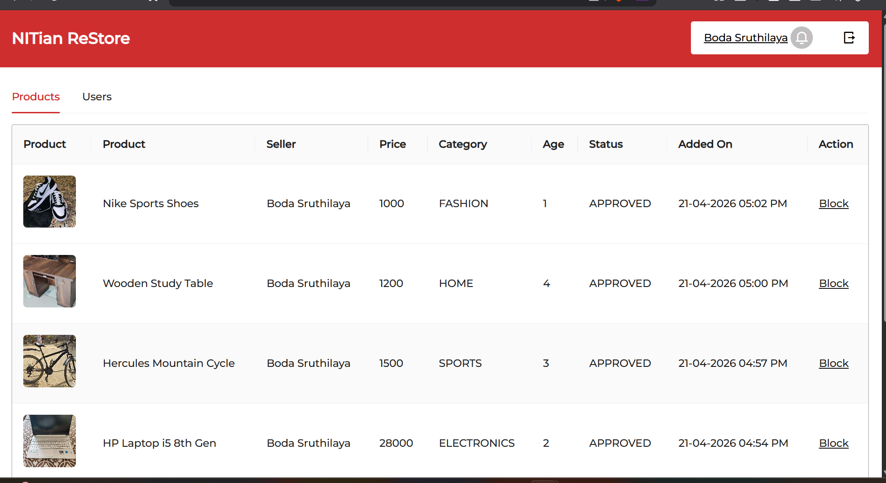
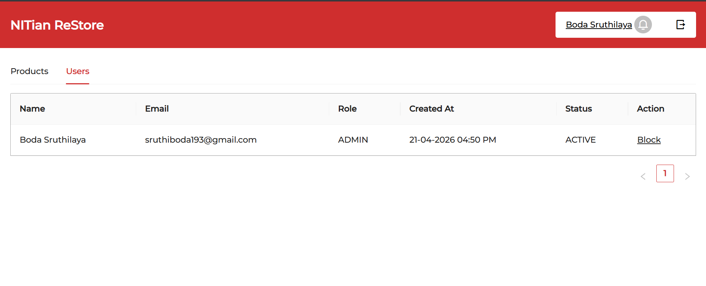

# NITian ReStore

NITian ReStore is the ultimate platform born out of a college hackathon project, transforming student sales within campus boundaries. It's where students can list their items for sale, negotiate prices through bids, and enjoy a seamless selling experience.

## Features

- **Secure Authentication**: Implemented JWT for safe user login and registration.
- **Product Showcase**: Students can showcase their products with detailed descriptions and images.
- **Dynamic Bidding**: Buyers can bid on items, sparking real-time negotiations.
- **Admin Approval**: Admin panel ensures only quality listings are displayed.
- **Personalized Profiles**: Users can manage their listings and profile details effortlessly.

## Tech Stack

- **MongoDB**: Efficient storage and retrieval of product data.
- **Express.js**: Backend framework for server-side logic.
- **React**: Building the sleek user interface.
- **Node.js**: Powering the backend server.
- **Ant Design & Tailwind CSS**: Elevating the user interface.
- **JWT**: Ensuring secure user authentication.
- **Redux**: Managing the application's state.

## Sneak Peek

## Screenshots

### Home Page

### Product Listing

### Users

## Installation

1. Clone the repository.
2. Install dependencies using `npm install`.
3. Start the server using `npm start`.

## How to Use

1. Register and login to the platform.
2. List your products for sale or bid on existing listings.
3. Admin users can approve product listings from the admin panel.

## Contributions Welcome

We welcome contributions! Feel free to create a new branch and submit a pull request for any enhancements or fixes.

## License

This project is licensed under the MIT License - see the LICENSE.md file for details.
